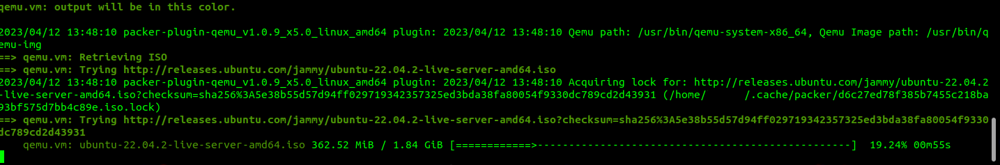
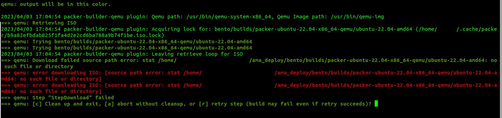

# Automated Malware Analysis Deployment

CAPE (Config And Payload Extraction) is a malware sandbox. It was derived from Cuckoo with the goal of adding automated malware unpacking and config extraction. Automated unpacking allows classification based on Yara signatures to complement network (Suricata) and behavior (API) signatures.
There is a free community instance online which anyone can use: [CAPE Sandbox](https://capesandbox.com)

Automated Malware Analysis Deployment is the directory containing all setup for building CAPE from scrath using virtual machine images.

## Initial Setup

Please follow each step for initial setup
1. Edit the number of CAPE virtual machines and their settings in [config.py](config.py) for automated VM creation
2. Ensure there is a valid BASE.xml file and qcow2 file located under [/transfer/guest_images/*/](transfer/guest_images/)
   - Note: if there are no valid files, contact project maintainers
3. Run the command
   ```
   sudo python3 run.py [-h][--log_level {warn,debug,info}] [--verbose] [--no_vinstall]
   ```

### Command Description

- [run.py](run.py): packages several build steps together for simplified deployment
  - run.py contains the following functionalities:
    - runs [ubuntu.install](ubuntu.install) installs all dependencies necessary to run on ubuntu
    - ensures bento dependencies
    - runs [prep.py](prep.py): generates VM images based off of config.py, and template files
    - runs [run.sh](run.sh): builds 4 stacked packer images
    - runs [vinstall.sh](vinstall.sh)
  - The usage of the script can be seen below.
    ```
    usage: run.py [-h] [--log_level {debug, info, warn}] [--verbose] [--no_vinstall] [--install_cape] [--clean]

    Runs install and setup steps

    options:
      -h, --help            show this help message and exit
      --log_level {debug, info, warn}
                            defines lowest level of log recorded
      --verbose             print logs to console
      --no_vinstall         disables vinstall.sh
      --install_cape        installs cape and neo4j docker containers
      --clean               deletes all existing builds, RUN WITH CARE
    ```

## Using CAPE
The result of run.py will be an image containing CAPE and the virtual machines. The two usage options are Virtual Machine Manager or Manual Install 

### Virtual Machine Manager

- spawned virtual machines can be accessed through Virtual Machine Manager by connecting with ssh
- credentials are vagrant:vagrant
- connecting to the CAPE system via ssh must be done with an ssh key. An ssh key can be created with the command:
  ```
  ssh-keygen
  ```

### Manual Install
- The image will be under builds/packer-capeextra
	- Convert the qcow2 to a .raw and write the .raw on a system with `dd`
	- that command might look like `dd if=/path/to/image of=/dev/sdx bs=2048M

## CAPE-Web
- Open a browser and conect to http://localhost:8000
- Click `submit` to upload malware samples. Select 
  - [cape2stix/ama_deploy/test_samples/](cape2stix/ama_deploy/test_samples/) contain non-malware programs that can be detonated in CAPE to replicate the effects of malware in the sandbox
- Alternatively, users can set up automatic analysis of the samples contained under a directory with the [capesubd](../capesubd/README.md) service
- Once a report is made, it can be downloaded by clicking `TODO: find the exact location users will find it on cape`

## Notes:
- The CAPE web-browser may not appear to load properly if using virtualization. This can be amended by adjusting the size of the browser with Ctrl (+/-)

- run.sh has strange output. If a build is succeeding it will have output similar to the following:
  
  - Soon after the command executes, the download bar appears. If that appears, there has been no error in run.sh
  - If run.py is executing run.sh commands, it will log everything except for the download bar    
  - Failure in execution will quickly result in the following error appearing:
    
  - This error is color coded and will wait for user input. This error ouput is the same in both run.sh and the implementation of run.sh in run.py
  - If an error will occur, it will occur relatively soon in the build process

- MongoDB created some issues with gpg keys. A quick solution was to store a copy of a key in [cape.sh](bash_scripts/cape.sh). If MongoDB updates, that key may not work. The user will then need to generate a key and paste it in place.

