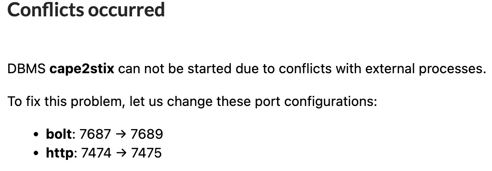
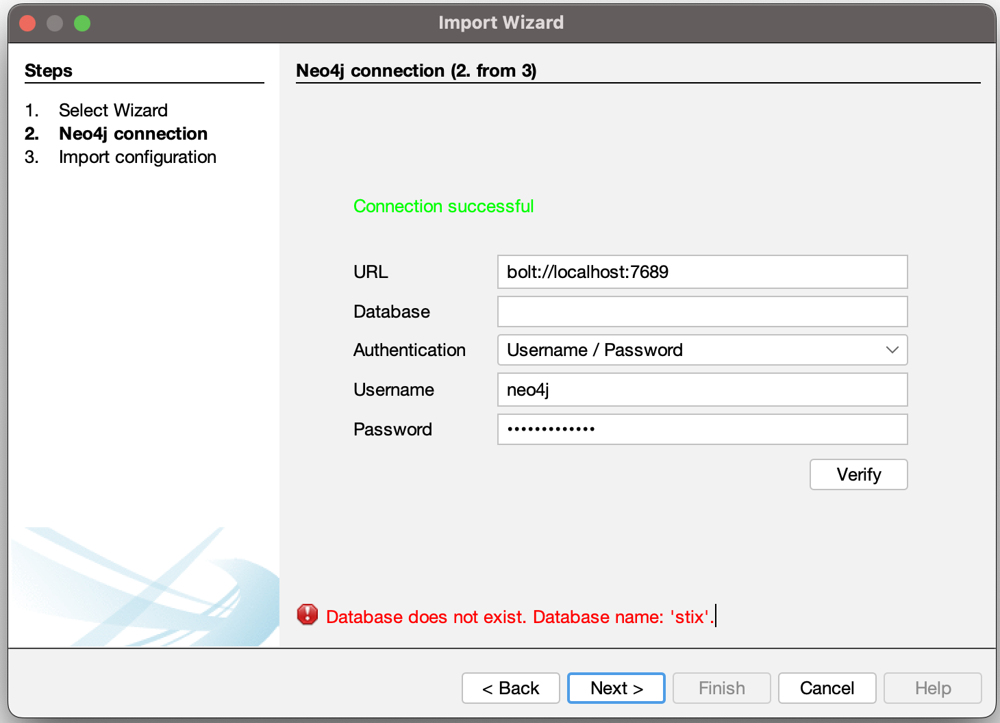
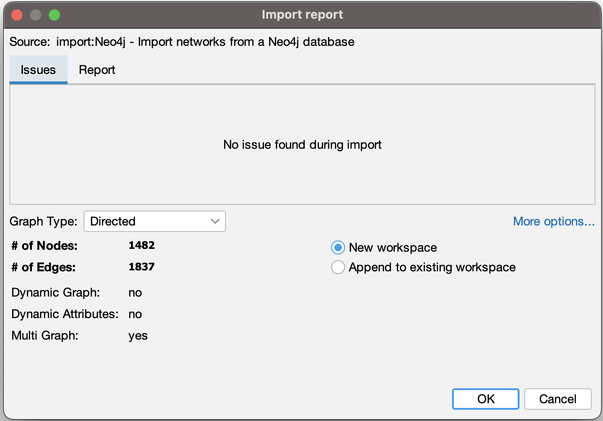
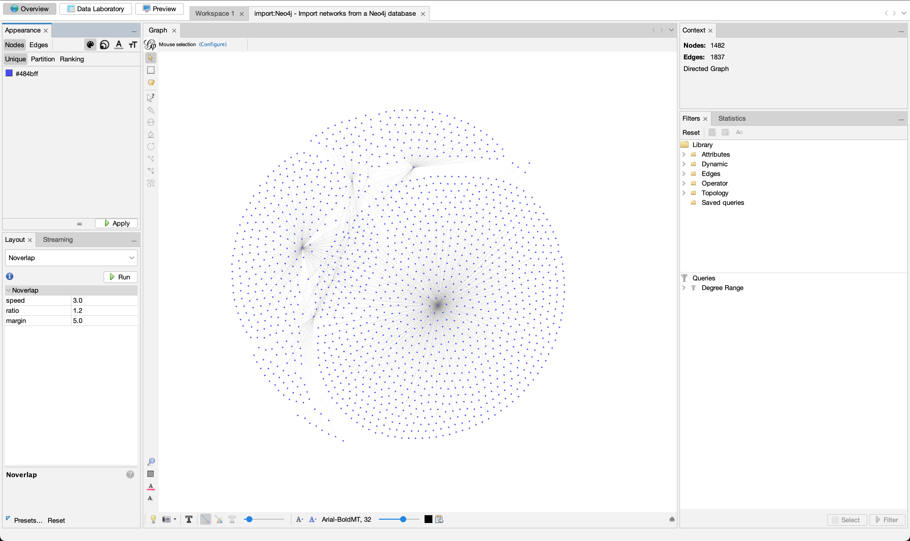

# Download Neo4J Desktop
Navigate to the following URL and install for your operating system:
https://neo4j.com/download-center/#desktop

Neo4J Desktop allows us a GUI to execute commands against a Neo4J database as well as view the data in a graph view.

## Linux
Run the AppImage

## Windows

## MacOS
Run the DMG file directly or move it to Applications and run like a traditional application.

## Database Setup
Create a database through the GUI.
If a conflicts occured popup is displayed, make a note of the returned configuration ports:





## Neo4J Plugins
### APOC
Ensure Plugin APOC is installed for this database.

### Neo4j Streams

### Others

# Neo4J Docker
TODO finish section
```docker
docker run \
    --publish=7474:7474 --publish=7687:7687 \
    --volume=$HOME/neo4j/data:/data \
    neo4j
```

TODO: Build Docker Image
TODO: Build docker-compose to spin up gephi and either this docker image or stock neo4j image

# Cape2stix
```bash
git clone https://github.com/idaholab/cape2stix
cd cape2stix
```

## Convert Data
If we have JSON files returned from cape2stix output and want them in STIX format:

```python
python(3) cape2stix/scripts/convert.py --file </path/to/file/or/directory> --log_level info
```

## Load Data
```bash
poetry shell
poetry install
cd cape2stix/cape2stix/todb/
```

If the bolt address mentioned through the <b>Database Setup</b> is not 7687 then change line 133 to the proper port.
```python
driver = neo4j.GraphDatabase.driver("bolt://localhost:7689", auth=(args.user, args.password))
```
Run
```bash
python(3) neo4jbulk.py </absolute/path/to/stix/file/or/directory> <neo4j_username> <database_password>
```

# Gephi
From Gephi's official website (https://gephi.github.io), download the TAR installer file.

## Linux
Once the download has finished, untar the file:
```bash
tar -xvf gephi.tar.gz
```

Ensure that the correct JAVA JRE/JDK path is set in gephi config.
```bash
cd gephi
vim /etc/gephi.config
```
On my linux host, JAVA JDK was installed at the following location: `/usr/lib/jvm/java-11-openjdk-amd64/`.
Replace the jdkhome variable with the correct location.

Run Gephi.
```bash
./bin/gephi
```

Alternatively, we can run Gephi with an environment variable to override jdkhome.
```bash
./bin/gephi --jdkhome /usr/lib/jvm/java-8-openjdk-amd64/
```

Select `New Project`

## Downloading Plugins
Click on `Tools --> Plugins --> Available Plugins`
Install the Graph Streaming and Neo4J plugins.
If these plugins do not exist in Available Plugins folder, click the `Check for Newest` button.


## Plugin Usage
### Neo4J
Click on `File --> Import --> Next`
Fill out the connection settings.
We do not need to state a database name if we are using bolt port.

Example:


Click the `Verify` button.

Ensure there were no issues during import and then click `Okay`.


Profit:




### Graph Streaming
TODO: Assuming we must have streaming plugin from Neo4J running..
