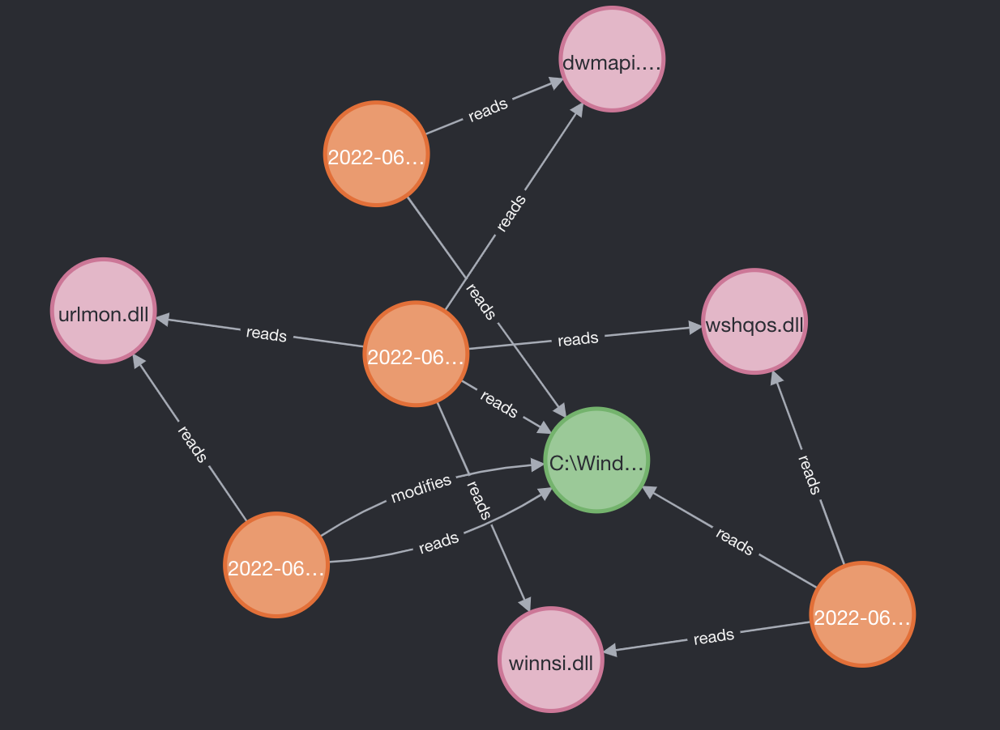

<h3 style="text-align: center;">Automated Malware Analysis</h3>

The purpose of this document is to demonstrate items of iterest from our analysis of dynamic malware execution. These items are assumed artifacts that security practitioners or forensics investigations would desire to know when determining if an unknown binary is malicious or not.

The analyzed binaries come largely from Malware Bazaar.

## Potential Ransomware
<b>Summary</b>
- Find any case where a malware object modifies more than 40 files. If a piece of malware modifies or deletes a file more than 40 times it can be considered ransomware and will allow us to assign a classification to the sample. This is useful for security pracitioners and forensics investigators because if we can assign labels to different malware samples it allows us to more easily identify emerging trends in more specifics contexts. It also allows for analysis on the similarities and differences between different types of samples within and outside of these labels. Enconding this data in nodes and edges in a graph allows us to conduct this analysis at a low resource cost and with a 100% success rate avoiding the drawbacks of conducting the same analysis with some artificial intelligence or machine learning technique. It seems reasonable to say that if a malware sample modifies over 40 files it can be considered a ransomware. It also seems reasonable to say that if a malware sample deletes over 40 files it can be considered a wiper. To execute this query change `r:modified` to `r:deletes`.

<b>Query</b>
```sql 
MATCH (x:malware)-[r:modifies]->(n:file) WITH x, count(distinct(r)) as rels WHERE rels > 40 RETURN x
```

<b>Graph</b> 


<b>Table</b>


<div style="page-break-after: always;"></div>

## Related IPs
<b>Summary</b>

- We know that thet `emotet` malware uses the ip '185.94.252.27/32'. Find all related ips from any malware that also call this IP. Answering this question would tell us if an unknown binary uses the same IP as a known binary. If there are matches, then we can assume they have similar authors. This identification can then allow security practitioners to respond in the most appropriate way given more context and will allow forensic investigators to use prior knowledge to conduct more accurate and efficient analysis of the malware sample.

<b>Query</b>
```sql
MATCH(x:malware)-[r]->(p:`ipv4-addr`)
WHERE p.value="185.94.252.27/32"
WITH x, p, count(r) as n
MATCH(k:malware WHERE k.id=x.id)-[r]->(l:`ipv4-addr`)
RETURN k as malware,r as rel,l as ipv4
```

<b>Graph</b> 


<b>Table</b>


<div style="page-break-after: always;"></div>

## Find File reads based on directory
<b>Summary</b>

- Find any `relationship_type` is 'reads' from regex 'C:\\Users\\Administrator\\'. Answering this question will allow us to determine if a binary is reading or writing to a filepath that we care to know about. Modifications within the administrator directory on a Windows machine is noteable as the malware sample is changing some file with administrative privileges. This information is valuable to security practitioners and forensics investigators as it provides a good starting point for conducting analysis and eliminates the noise you might see in a malware sample that has been coded to cover its tracks and hide worthwhile information.

<b>Query</b>
```sql
MATCH (n) - [r:reads] -> (d:directory WHERE d.path =~ '(?i)c:\\\\users\\\\administrator') return n
```

<b>Graph</b> 


<b>Table</b>


<div style="page-break-after: always;"></div>

## Specific Extension in Directory
<b>Summary</b>

- Find any malware that writes 6 characters with dll extension in Windows directory. A security practitioner might be interested if a binaries execution results in a specific filetype such as a Dynamic Link Library (DLL) being written. If a dll is identified and provides malicious functionality to a malware sample it would be worth identifying for future binary analysis. Depending on whether the dll provides malicious or benign functionality to the malware sample, it can be marked as insignificant or analyzed further. 

<b>Query</b>
```sql
MATCH (f:file WHERE f.name =~ '.{6}.dll') <- [r1] - (m:malware) - [r2] -> (d:directory WHERE d.path =~ '(?i).*\\\\windows.*') WHERE f.parent_directory_ref = d.id RETURN f, r1, m, r2, d
```
    
<b>Graph</b> 


<b>Table</b>


<div style="page-break-after: always;"></div>

## Most Accessed File
<b>Summary</b>

- Determine the most accessed files across all analyzed malware. Answering this question will allow security practitioners to know what files or directories are most often read or written to during malware execution. This can lead to identifying what processes are being modified, where the malware is storing persistent data, what user is executing the malware, etc.
    
<b>Query</b>
```sql
MATCH (f:file) <- [r:reads] - (m:malware) RETURN f, m, apoc.node.degree(f) AS cnt ORDER BY cnt DESC
```

    
<b>Graph</b> 


<b>Table</b>


<div style="page-break-after: always;"></div>

## Process Discovery TTP
<b>Summary</b>

- Find all related Malware that has "Process Discovery" Tactic (attack-pattern). MITRE ATT&CK and Lockheed Martin Kill-Chains are often used in writeup reports and publications in a malware analysis report. Knowing how to search the dataset for this kind of information will be useful. This label also allows for labeling different malware samples and provides the same advantages mentioned in the Potential Ransomware summary.
    
<b>Query</b>
```sql
MATCH (m:malware) - [r:uses] -> (a:`attack-pattern` WHERE a.name =~ 'Process Discovery') RETURN m, r, a
```

<b>Graph</b> 


<b>Table</b>


<div style="page-break-after: always;"></div>

<!-- ## MITRE ATT&CK Technique
<b>Summary</b>

- Find all related Malware that has a certain MITRE Att&ck technique:
- Answering this question
- SAME AS ABOVE, maybe remove this one
    
<b>Query</b>
```sql
MATCH (m:malware) - [r:uses] -> (a:attack-pattern WHERE a.name =~ 'Process Discovery') RETURN m, r, a
```

    
<b>Graph</b> 


<b>Table</b>


<div style="page-break-after: always;"></div> -->

## Looking for Domain Names
<b>Summary</b>

- Find all malware that calls the domain name `cloudapp`. Suppose we know a specific domain name that is used for nefarious purposes. The following query is how we can search the dataset for any analyzed binary that calls that domain directly. To determine domain names of interest, we can issue a query to return the top 10 domain names used across all samples. This provides the same advantages mentioned in the Related IPs summary.
    
<b>Query</b>
```sql
MATCH (m:malware) - [r:uses] -> (d:`domain-name` WHERE d.value =~ '.*cloudapp.*') RETURN m, r, d
```

<b>Graph</b> 


<b>Table</b>


<div style="page-break-after: always;"></div>

## Something with Filehashes
<b>Summary</b>

- Find some information about filehashes
- Answering this question
- TODO: Taylor recommends removing if nothing more specific can be found. Are dynamic hashes being used in this dataset? If so similarity scores could be interesting
- TODO: Need to specify this more to what we would want to look for.
- Might need to remove this as it's nothing more difficult than a single query match, but file hashes are a common observable that is used in threat intelligence. I do not believe there is a way to compare file hashes for similarity within Neo4J. In fact I believe similarity comparison for file hashes they would have to be of a certain type (not MD5). @Rcooley might be able to give insight.

    
<b>Query</b>
```sql
MATCH (f:file WHERE f.hashes =~ '.[0-9,a-z,A-Z]{64}.' OR f.hashes =~ '.[0-9,a-z,A-Z]{32}.') RETURN f
```

<b>Graph</b> 


<b>Table</b>


<div style="page-break-after: always;"></div>

## Non-Standard Ports used
<b>Summary</b>

- Find all malware that have network-traffic which uses non-standard ports for src/destination. Use MITRE list https://attack.mitre.org/techniques/T1571/.
- TODO: Change
- Meeting 3 weeks ago migh want to change this.
- Note from Taylor: `I went through the list on the MITRE website running all of the listed ports through the database and I did not get any results that contain any of the weird ports listed and all of the network traffic nodes that I queried used pretty standard TCP/UDP ports. Will continue looking.`
- Note from Taylor: `Since none of the network nodes follow the structure listed on the MITRE site and since the query listed above will work to answer the question with a specific src and dst port in mind, this issue is being closed.`
    
<b>Query</b>
```sql
MATCH (n:"network-traffic") WHERE n.protocols CONTAINS 'tcp' AND n.src_port = 808 and n.dst_port = 80 RETURN n LIMIT 10
```

<b>Graph</b> 


<b>Table</b>


<div style="page-break-after: always;"></div>

# Other Potential Artifacts
## Process
## Registry-Keys
