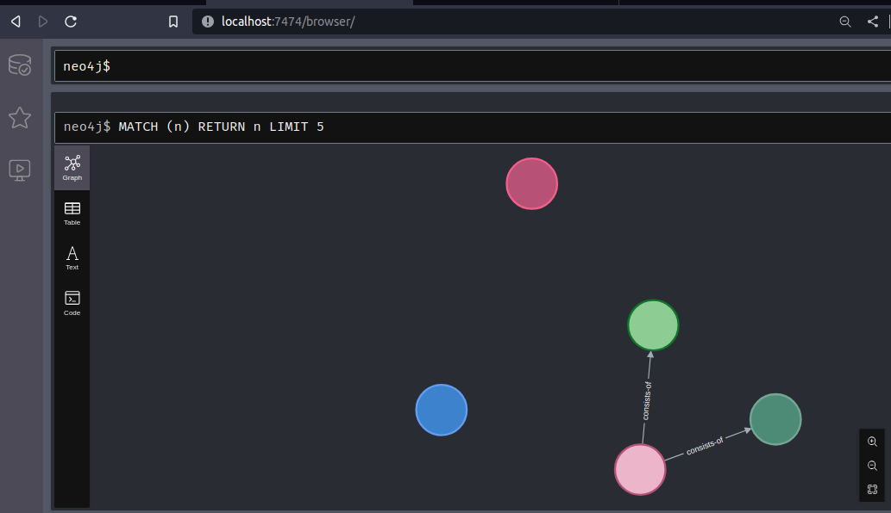

# NEO4j Setup
Neo4j is the database used to store and conduct analysis on converted CAPE reports. Users can either auto-build the docker container or manually install the database.

## Auto-Build - AMA_DEPLOY
The preferred neo4j installation technique is with the docker container provided in the CAPE2STIX project. This method will compose docker containers for cape2stix and neo4j. See the [ama_deploy command-description](../ama_deploy.md#command-description) for more information. <br>Alternatively, users only needing neo4j can start the container with docker-compose:
```bash
cd cape2stix/todb/
sudo docker-compose up -d
```
## Neo4j Access
- A database named neo4j will be created. It can be accessed from a web-browser with the address `localhost:7474/browser/`
- Credentials are currently defined in the docker-compose file as `neo4j:test`. This can be edited.
- If there are conflicts on the ports 7474 and 7687, these can be edited in the docker compose.
    - **7474 http** - The port for accessing the browser application
        - If the http port is changed, use the new port for accessing **localhost:`port`/browser/**
    - **7687 bolt** - The port for accessing the database.
        - If the bolt port is changed, edit [line 134 of neo4j_bulk](../../cape2stix/todb/neo4j_bulk.py#L134), changing 7689 to the new bolt port number.
        ```python
        driver = neo4j.GraphDatabase.driver("bolt://localhost:7689", auth=(args.user, args.password))
        ```

## Submitting to Neo4j
To submit, users need to be in the poetry shell environment and the todb/ directory. 
```bash
poetry shell
poetry install
cd cape2stix/cape2stix/todb/
```
Submit STIX files to the neo4j database with the following command:
```bash
python3 neo4j_bulk.py </absolute/path/to/stix/file/or/directory> <neo4j_username> <database_password>
```
Neo4j queries are done in the [Cypher Query Language](https://neo4j.com/developer/cypher/)<br>An example of a query in the browser can be seen below


## Additional 