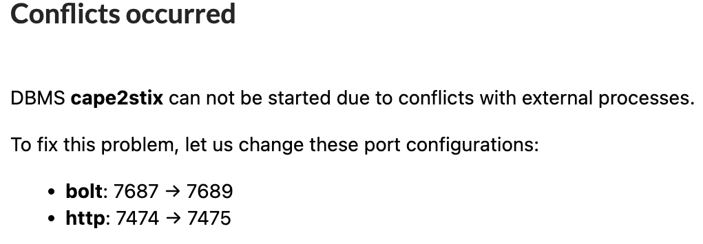
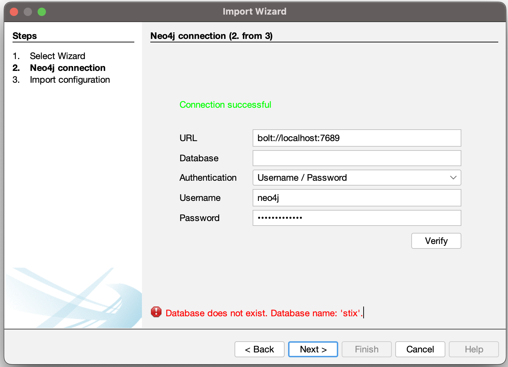
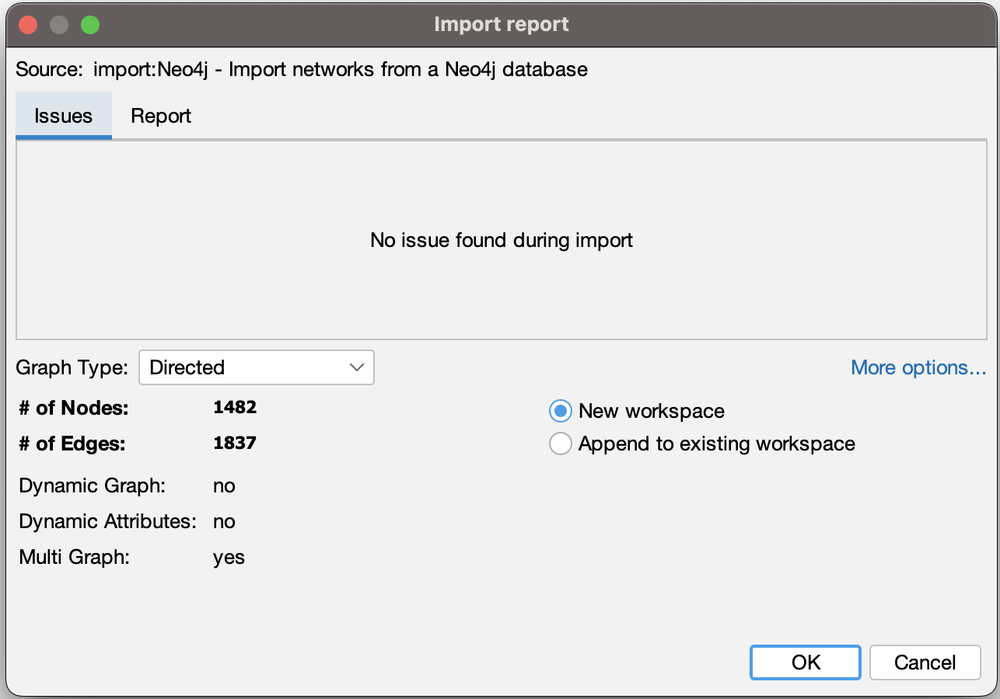
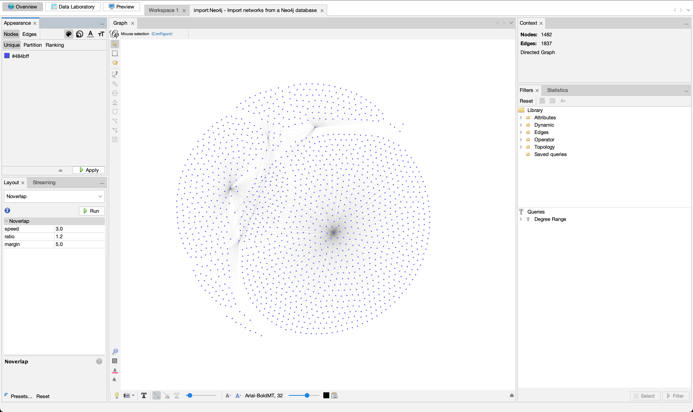

# Download Neo4J Desktop
Navigate to the following URL and install for your operating system:
https://neo4j.com/download-center/#desktop

Neo4J Desktop allows us a GUI to execute commands against a Neo4J database as well as view the data in a graph view.

|Operating System|Installation|
|----------------|------------|
|**Linux**  |Run the AppImage|
|**Windows**|Run the executable(exe) by either clicking on it from the file explorer or running it as a program on the command line|
|**MacOS**  |Run the DMG file directly or move it to Applications and run like a traditional application.|

## Database Setup
Create a database through the GUI.
If a ***Conflicts occured*** pop-up is displayed, make a note of the returned configuration ports:




# Neo4J Docker and CAPE2STIX
Install the neo4j docker container and submit STIX to the database as detailed in the [Neo4j README](Neo4j_README.md).

# Gephi
From Gephi's official website (https://gephi.github.io), download the TAR installer file.

## Linux
Once the download has finished, untar the file:
```bash
tar -xvf gephi.tar.gz
```

Ensure that the correct JAVA JRE/JDK path is set in Gephi config.
```bash
cd gephi
nano /etc/gephi.config
```
When tested, the JAVA JDK was installed at: `/usr/lib/jvm/java-11-openjdk-amd64/`.<br>Replace the jdkhome variable with the correct location.

Run Gephi.
```bash
./bin/gephi
```

Alternatively, users can run Gephi with an environment variable to override jdkhome.
```bash
./bin/gephi --jdkhome /usr/lib/jvm/java-8-openjdk-amd64/
```

Select `New Project`

## Downloading Plugins
Click on `Tools --> Plugins --> Available Plugins`
Install the Graph Streaming and Neo4J plugins.
If these plugins do not exist in Available Plugins folder, click the `Check for Newest` button.


## Plugin Usage
### Neo4J
Click on `File --> Import --> Next`
Fill out the connection settings.
We do not need to state a database name if we are using bolt port.

Example:


Click the `Verify` button.

Ensure there were no issues during import and then click `Okay`.


Profit:



